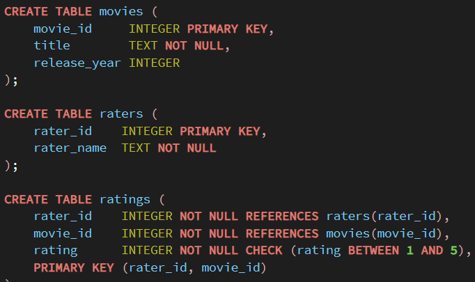
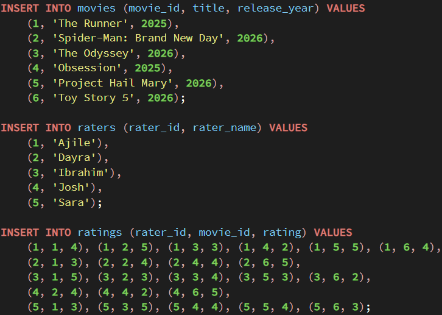

## Approach

In this assignment, I will gather and save movie ratings to analyze them in R later. Six movies, namely The Runner, Spider-Man: Brand New Day, The Odyssey, Obsession, Project Hail Mary, and Toy Story 5, will be rated on a scale from 1 to 5 by at least five people using one common form and stored in PostgreSQL database (using SQLite in case of any issues), employing the structure where movies, raters, and ratings tables will be used; in case of not seen movie, there is just no entry. To get the data into R, I will export the data to a csv and load it in.

## Code Deliverable

The first step was to create three tables for users, movies, and ratings:

{width="470"}

This is done so that each rater and movie is stored once, and the many-to-many relationship between the two variables, is captured in the ratings table, which serves as a junction. To handle a scenario where a rater hasn't seen a certain movie, a rater simply does not have a row in ratings for that pair.

Next was to input the data into the tables:



After creating the tables, I then had to load them into R as a data frame. I decided to do this by converting them all to .csv files and reading them in:


```{r}
library(readr)
ratings_long <- read_csv("movies.csv", col_names = FALSE)
```

```{r}
library(tidyverse)
```

The ,csv file does not give any column names to the data, which is why the below code is written:

```{r}
names(ratings_long) <- c("rater_name", "title", "rating")

head(ratings_long)
```

Count ratings per user and movie:

```{r}
ratings_per_movie <- ratings_long |>
  count(title, name = "n_ratings") |>
  arrange(desc(n_ratings))

ratings_per_movie
```

```{r}
ratings_per_rater <- ratings_long |>
  count(rater_name, name = "n_ratings") |>
  arrange(desc(n_ratings))

ratings_per_rater
```
