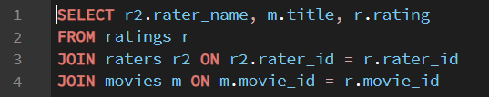

## Approach

In this assignment, I will gather and save movie ratings to analyze them in R later. Six movies, namely The Runner, Spider-Man: Brand New Day, The Odyssey, Obsession, Project Hail Mary, and Toy Story 5, will be rated on a scale from 1 to 5 by at least five people using one common form and stored in PostgreSQL database (using SQLite in case of any issues), employing the structure where movies, raters, and ratings tables will be used; in case of not seen movie, there is just no entry. To get the data into R, I will export the data to a csv and load it in.

## Code Deliverables

I used the following SQL code to export the data to a csv:



```{r}
library(readr)

```

```{r}
library(tidyverse)
```

```{r}
ratings_long <- read_csv("movies.csv", col_names = FALSE)
names(ratings_long) <- c("rater_name", "title", "rating")

head(ratings_long)
```

```{r}
glimpse(ratings_long)
```

```{r}
names(ratings_long)
head(ratings_long)
```

```{r}
ratings_per_movie <- ratings_long |>
  count(title, name = "n_ratings") |>
  arrange(desc(n_ratings))

ratings_per_movie
```

```{r}
ratings_per_rater <- ratings_long |>
  count(rater_name, name = "n_ratings") |>
  arrange(desc(n_ratings))

ratings_per_rater
```
